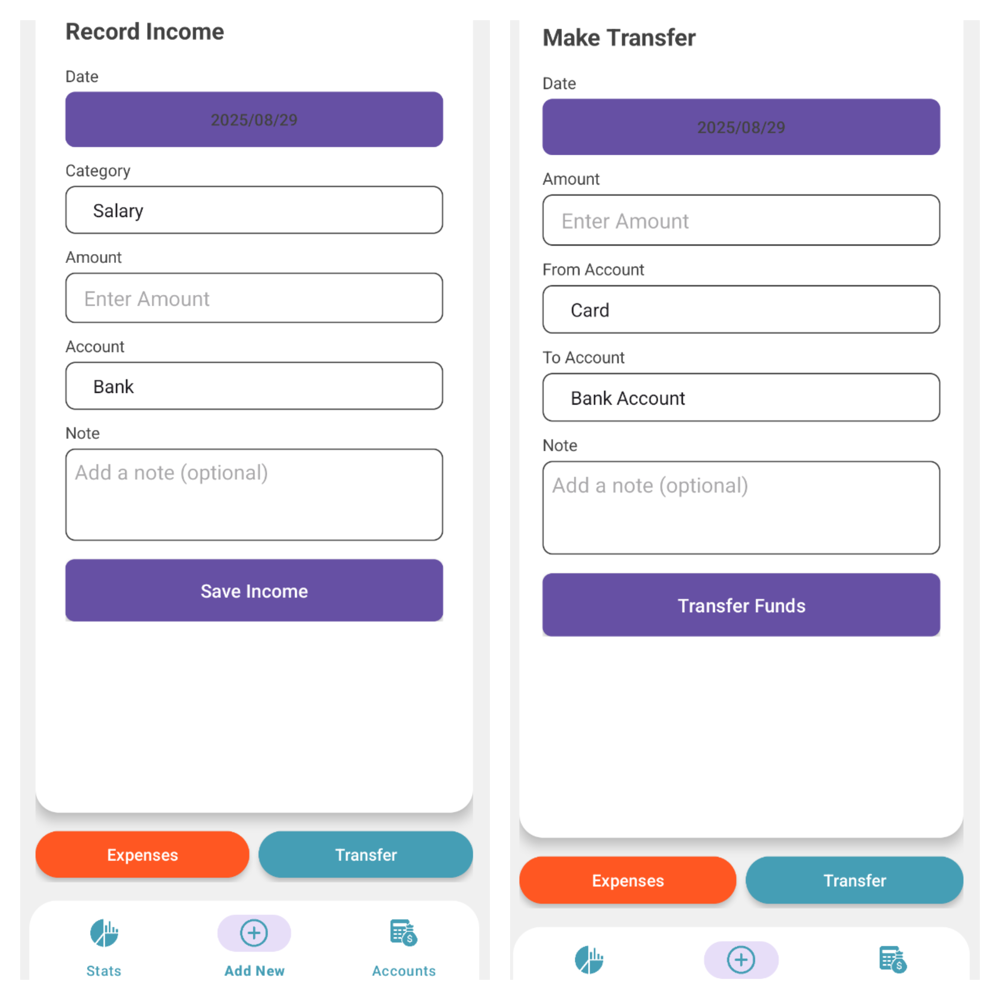
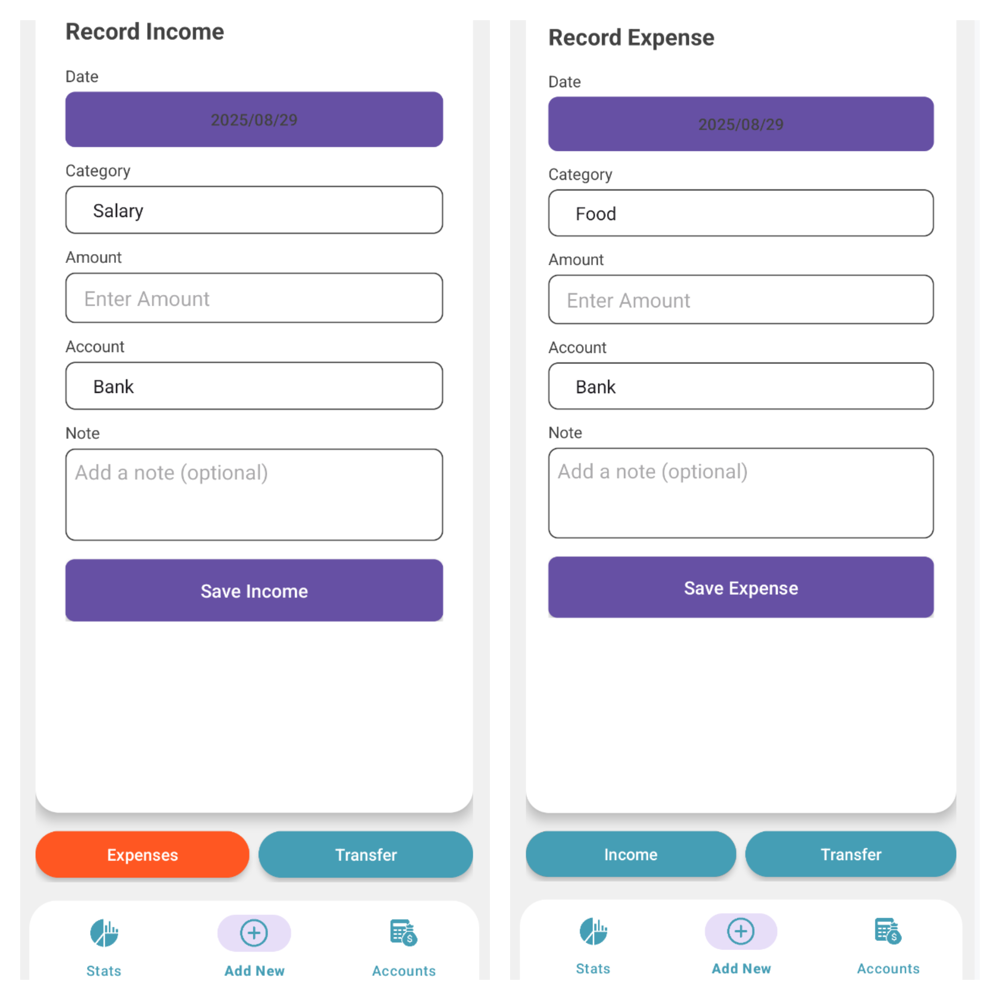

Expense and Income  Track App

A simple Android app to track personal income, expenses, and transfers, built with Kotlin.

Features

         Add, view, and manage  Income Expenses
         Easy navigation with fragments.
         Clean and user-friendly interface.
         Categorized tracking for better financial insights.

Technologies Used

      Language:Kotlin
      Platform: Android Studio
      Architecture:MVVM / Fragment-based navigation
      Database: Room (SQLite)

Here’s a screenshot of the app:

